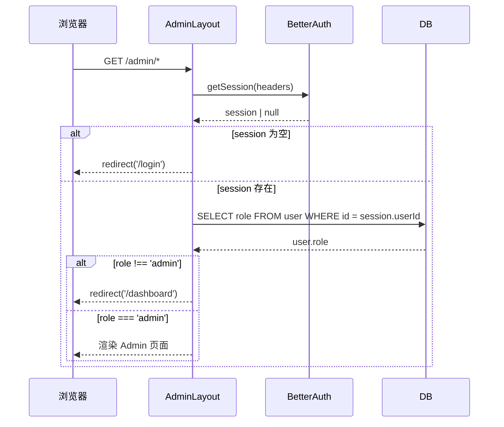
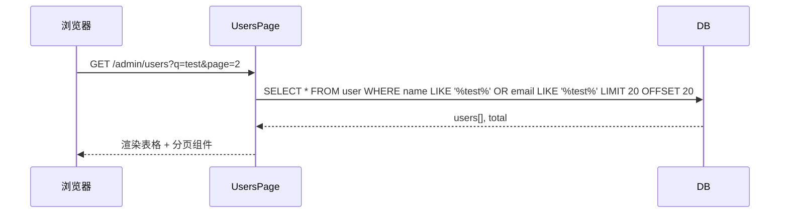

# 设计文档

## 概览

Admin Dashboard 为 ShipFree SaaS 模板提供基础管理后台框架，让模板使用者开箱即可拥有用户管理和数据概览能力。本功能在现有 Next.js App Router 架构之上，新增独立的 `(admin)` 路由组，通过服务端权限验证确保只有管理员可访问。

**目标用户**：部署了 ShipFree 模板的 SaaS 产品管理员。他们需要快速查看平台运营数据（用户数、订阅数、收入）并管理注册用户（列表查看、搜索）。

**技术影响**：在 `user` 表新增 `role` 字段（`user` | `admin`），新增独立的 admin layout、页面组件和服务端数据查询函数，所有新组件使用已有的 Shadcn UI 组件库（`src/components/ui/`）。

### 目标

- 提供一个安全、独立的管理后台入口，权限控制在服务端完成
- 数据概览页展示 4 个关键 KPI 卡片（总用户、本月新增用户、活跃订阅、总收入）
- 用户列表页支持分页（每页 20 条）和关键词搜索（按姓名/邮箱）
- 响应式布局：桌面端侧边栏导航，移动端抽屉导航
- 全部 UI 使用现有 `src/components/ui/` 中的 Shadcn UI 组件

### 非目标

- 用户编辑/删除等写操作（本期仅只读）
- 高级数据可视化图表（如折线图、柱状图）
- 权限分级（超级管理员 / 普通管理员）
- 审计日志功能
- 订阅/支付的管理操作

## 架构

### 现有架构分析

- 路由：`src/app/(main)/` 已有普通用户 dashboard，管理后台独立为 `src/app/(admin)/` 路由组，保持职责分离
- 认证：`src/lib/auth/auth.ts` 使用 Better-Auth，session 通过 `auth.api.getSession()` 在服务端获取
- 数据库：`src/database/schema.ts` 已有 `user`、`subscription`、`payment` 表，可直接查询
- UI：`src/components/ui/` 已包含 card、table、button、input、skeleton、badge、sheet、pagination 等 Shadcn 组件

### 架构模式与边界

```mermaid
graph TD
  A[浏览器请求 /admin/*] --> B[AdminLayout 服务端组件]
  B --> C{session 存在?}
  C -- 否 --> D[重定向 /login]
  C -- 是 --> E{user.role === admin?}
  E -- 否 --> F[重定向 /dashboard]
  E -- 是 --> G[渲染 Admin 页面]

  G --> H[/admin 概览页]
  G --> I[/admin/users 用户列表页]

  H --> J[getAdminStats 服务端查询]
  I --> K[getUsers 服务端查询]

  J --> L[(PostgreSQL via Drizzle)]
  K --> L
```

**架构集成说明**：
- 选用模式：**服务端优先 + 独立路由组**，与现有 `(main)` 路由组模式一致
- 权限控制：在 `AdminLayout` 服务端组件中完成，无客户端 bypass 风险
- 数据获取：服务端 async 组件直接调用 Drizzle 查询，无需 API 路由
- 新增组件与现有 `(main)` 路由组完全隔离

### 技术栈

| 层次 | 选择 | 说明 |
|------|------|------|
| 路由/页面 | Next.js App Router `(admin)` 路由组 | 与现有 `(main)` 路由组模式一致 |
| UI 组件 | Shadcn UI（已有 `src/components/ui/`） | Card、Table、Button、Input、Skeleton、Badge、Sheet、Pagination |
| 图标 | lucide-react（项目已安装） | 与现有 dashboard 一致 |
| 数据查询 | Drizzle ORM 直接查询（服务端） | 无需新增 API 路由 |
| 认证校验 | Better-Auth `auth.api.getSession()` | 与现有 `(main)` layout 一致 |
| 国际化 | next-intl `getTranslations` | 服务端组件模式 |

## 系统流程

### 权限验证流程



### 用户列表搜索分页流程



## 需求追踪

| 需求 | 摘要 | 组件 | 接口 | 流程 |
|------|------|------|------|------|
| 1 | 管理员权限控制 | AdminLayout | - | 权限验证流程 |
| 2 | 数据概览仪表板 | AdminOverviewPage, StatsCards | getAdminStats | - |
| 3 | 用户列表管理 | AdminUsersPage, UsersTable | getUsers | 搜索分页流程 |
| 4 | 管理后台导航 | AdminLayout, AdminSidebar, AdminMobileNav | - | - |
| 5 | Shadcn UI 集成 | 全部 Admin 组件 | - | - |

## 组件与接口

### 组件汇总

| 组件 | 层次 | 职责 | 需求覆盖 | 关键依赖 |
|------|------|------|----------|----------|
| AdminLayout | 路由/布局 | 权限验证 + 框架布局 | 1, 4 | BetterAuth, AdminSidebar |
| AdminSidebar | UI/导航 | 桌面端侧边栏导航 | 4 | Shadcn Button, 路由活跃状态 |
| AdminMobileNav | UI/导航 | 移动端抽屉导航 | 4 | Shadcn Sheet |
| AdminOverviewPage | 页面 | 概览仪表板 | 2 | StatsCards, getAdminStats |
| StatsCards | UI | KPI 统计卡片组 | 2 | Shadcn Card, Skeleton |
| AdminUsersPage | 页面 | 用户列表页 | 3 | UsersTable, getUsers |
| UsersTable | UI | 用户数据表格 | 3, 5 | Shadcn Table, Pagination |

### 路由层

#### AdminLayout

| 字段 | 详情 |
|------|------|
| 意图 | 权限验证 + 渲染管理后台框架布局 |
| 需求 | 1, 4 |

**职责与约束**
- 在服务端通过 `auth.api.getSession()` 验证登录状态
- 查询数据库确认 `user.role === 'admin'`，否则重定向
- 渲染包含侧边栏和内容区域的 admin 布局框架

**依赖**
- 入站：浏览器 HTTP 请求
- 出站：BetterAuth（session 查询）、Drizzle（用户角色查询）
- 外部：next/navigation redirect

**契约**：服务端组件 [x]

```typescript
// src/app/(admin)/layout.tsx
export default async function AdminLayout({
  children,
}: {
  children: React.ReactNode
})
```

**文件路径**：`src/app/(admin)/layout.tsx`

#### AdminOverviewPage

| 字段 | 详情 |
|------|------|
| 意图 | 渲染概览仪表板，展示 KPI 统计卡片 |
| 需求 | 2 |

**服务端数据查询接口**

```typescript
// src/app/(admin)/actions/stats.ts
interface AdminStats {
  totalUsers: number
  newUsersThisMonth: number
  activeSubscriptions: number
  totalRevenue: string // 格式化货币字符串
}

async function getAdminStats(): Promise<AdminStats>
```

**文件路径**：
- 页面：`src/app/(admin)/page.tsx`
- 数据查询：`src/app/(admin)/actions/stats.ts`
- 组件：`src/app/(admin)/components/stats-cards.tsx`

#### AdminUsersPage

| 字段 | 详情 |
|------|------|
| 意图 | 渲染用户列表，支持分页和搜索 |
| 需求 | 3, 5 |

**服务端数据查询接口**

```typescript
// src/app/(admin)/actions/users.ts
interface GetUsersParams {
  page: number    // 从 1 开始
  pageSize: number  // 默认 20
  query?: string  // 搜索关键词
}

interface GetUsersResult {
  users: Array<{
    id: string
    name: string
    email: string
    emailVerified: boolean
    image: string | null
    createdAt: Date
  }>
  total: number
  pageCount: number
}

async function getUsers(params: GetUsersParams): Promise<GetUsersResult>
```

**API 路由（页面组件接收 searchParams）**

| searchParam | 类型 | 说明 |
|-------------|------|------|
| `page` | string \| undefined | 当前页码，默认 "1" |
| `q` | string \| undefined | 搜索关键词 |

**文件路径**：
- 页面：`src/app/(admin)/users/page.tsx`
- 数据查询：`src/app/(admin)/actions/users.ts`
- 组件：`src/app/(admin)/components/users-table.tsx`

### UI 层

#### AdminSidebar

| 字段 | 详情 |
|------|------|
| 意图 | 桌面端固定侧边栏，显示导航项和当前路由高亮 |
| 需求 | 4 |

```typescript
// src/app/(admin)/components/admin-sidebar.tsx
// 服务端组件（使用 pathname 判断需要 'use client'）
const navItems = [
  { href: '/admin', label: '概览', icon: LayoutDashboard },
  { href: '/admin/users', label: '用户管理', icon: Users },
]
```

#### AdminMobileNav

| 字段 | 详情 |
|------|------|
| 意图 | 移动端汉堡菜单 + Sheet 抽屉导航 |
| 需求 | 4, 5 |

使用 Shadcn `Sheet` 组件（`src/components/ui/sheet.tsx` 已存在）实现抽屉效果。

**文件路径**：`src/app/(admin)/components/admin-mobile-nav.tsx`（需要 `'use client'`）

#### StatsCards

```typescript
// src/app/(admin)/components/stats-cards.tsx
// 服务端组件
interface StatsCardsProps {
  stats: AdminStats
}
```

4 个 Shadcn `Card` 组件，每张卡片包含：图标、标题、数值、子标题。

#### UsersTable

```typescript
// src/app/(admin)/components/users-table.tsx
// 服务端组件（表格内容）+ 客户端搜索输入组件
interface UsersTableProps {
  users: GetUsersResult['users']
  total: number
  page: number
  pageCount: number
  query?: string
}
```

使用 Shadcn `Table`（已有）渲染用户数据，底部使用 Shadcn `Pagination`（已有）。

## 数据模型

### 领域模型变更

在 `user` 表新增 `role` 字段：

```typescript
// src/database/schema.ts 新增字段
role: text('role').notNull().default('user'), // 'user' | 'admin'
```

此字段无外键依赖，不影响现有级联删除逻辑。

### 物理数据模型

**新增迁移**：修改 `user` 表，添加 `role` 字段

```sql
ALTER TABLE "user" ADD COLUMN "role" text NOT NULL DEFAULT 'user';
```

执行后需运行：`bun run generate-migration && bun run migrate:local`

### 数据查询设计

**getAdminStats 查询**（`src/app/(admin)/actions/stats.ts`）：
```typescript
// 并行执行以下 4 个查询：
// 1. SELECT count(*) FROM user
// 2. SELECT count(*) FROM user WHERE created_at >= first_day_of_month
// 3. SELECT count(*) FROM subscription WHERE status = 'active'
// 4. SELECT sum(amount) FROM payment WHERE status = 'succeeded'
const [totalUsers, newUsers, activeSubs, revenue] = await Promise.all([...])
```

**getUsers 查询**（带搜索和分页）：
```typescript
// WHERE name ILIKE '%query%' OR email ILIKE '%query%'
// LIMIT pageSize OFFSET (page - 1) * pageSize
// 同时 count(*) 获取总数
```

## 错误处理

### 错误策略

管理后台数据为只读查询，错误处理以降级展示为主，不影响用户核心业务流程。

### 错误类别与响应

**用户权限错误**：
- 未登录 → 服务端 redirect 至 `/login`
- 非管理员 → 服务端 redirect 至 `/dashboard`

**数据加载错误**：
- 数据库查询失败 → 展示 Error 状态组件，显示"数据加载失败，请刷新重试"
- 使用 Next.js `error.tsx` 边界捕获页面级错误

**空状态**：
- 用户列表为空 → 展示 Empty 组件（`src/components/ui/empty.tsx` 已存在）

### 监控

服务端查询错误通过 `console.error` 记录，生产环境由 Sentry 捕获（项目已集成）。

## 测试策略

### 单元测试
- `getAdminStats` 函数：模拟 Drizzle 返回值，验证统计数字计算逻辑
- `getUsers` 函数：测试分页偏移量计算、搜索关键词处理

### 集成测试
- AdminLayout 权限验证：非管理员访问应触发 redirect
- 用户列表分页：`page=2&q=test` 参数正确传递至查询

### E2E 测试（可选）
- 管理员登录 → 访问 `/admin` → 看到 4 个统计卡片
- 管理员访问 `/admin/users` → 搜索用户 → 分页跳转

## 安全考量

- **服务端权限验证**：AdminLayout 在服务端校验 role，不依赖客户端状态
- **只读操作**：本期管理后台仅查询，无写操作，SQL 注入风险通过 Drizzle ORM 参数化查询规避
- **管理员账户设置**：初始管理员通过直接操作数据库设置 role，不提供 UI 入口（降低攻击面）
- **ILIKE 查询**：使用参数化查询，不直接拼接用户输入

## 性能与可扩展性

- `getAdminStats` 使用 `Promise.all` 并行执行 4 个查询，减少串行等待
- `user` 表 `role` 字段应添加索引（仅在用户量大时考虑）
- 用户列表默认每页 20 条，避免大数据量返回
- 服务端渲染，无客户端状态管理开销
