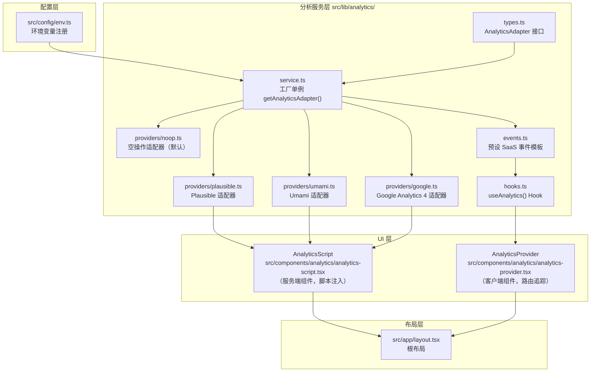
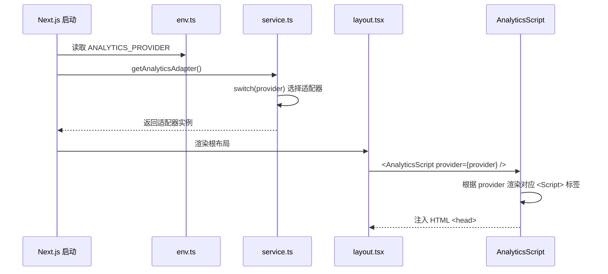
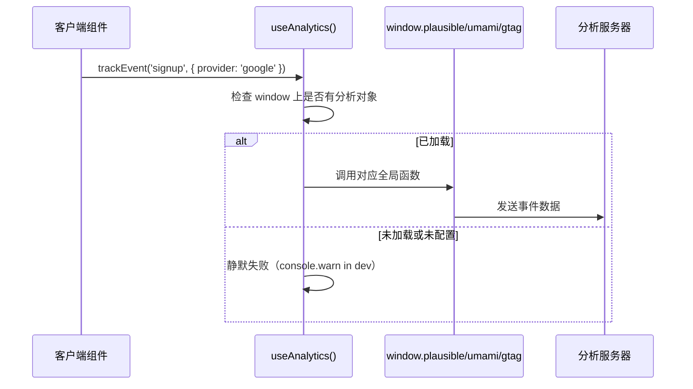
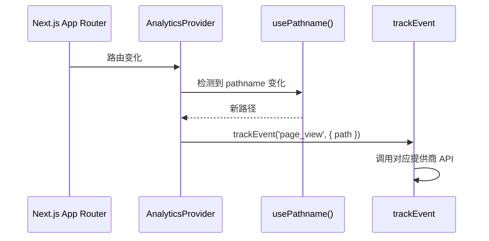

# 设计文档

## 概述

本功能为 ShipFree 模板集成隐私友好的分析服务，采用与现有支付适配器（`src/lib/payments/`）和邮件适配器（`src/lib/messaging/email/`）完全一致的适配器（策略）模式。开发者通过设置 `ANALYTICS_PROVIDER` 环境变量即可切换 Plausible、Umami 或 Google Analytics，无需修改任何业务代码。

**目标用户：** 使用 ShipFree 脚手架的开发者，希望快速接入分析服务，了解用户行为，同时保持隐私合规（GDPR/CCPA）。

**影响范围：** 在现有根布局（`src/app/layout.tsx`）中注入分析脚本；在 `src/lib/analytics/` 下新建适配器模块；在 `src/config/env.ts` 中注册新环境变量。不修改数据库 schema，不引入新的 API 路由。

### 目标

- 通过适配器模式统一封装 Plausible、Umami、Google Analytics
- 提供 `useAnalytics()` Hook 和预设 SaaS 事件模板，开箱即用
- 自动追踪 Next.js App Router 路由变化，无需手动埋点
- 开发环境静默降级（console 输出），生产环境发送到分析服务

### 非目标

- 不实现服务端分析数据聚合或自建分析 API
- 不实现 Plausible/Umami 自托管服务的部署配置
- 不实现 A/B 测试或热图功能
- 暂不实现同时启用多个分析提供商

---

## 架构

### 现有架构分析

项目已有两个适配器模式实现可参考：

1. **支付适配器**（`src/lib/payments/`）：`types.ts` 定义接口 → `service.ts` 单例工厂 → `providers/` 各实现
2. **邮件适配器**（`src/lib/messaging/email/`）：同样结构，加上自动发现机制

分析适配器将沿用相同的目录和代码组织模式，确保风格一致性。

### 架构模式与边界图



**架构决策：**
- 脚本注入（`AnalyticsScript`）使用服务端组件，在 HTML `<head>` 中渲染 `<Script>` 标签
- 路由追踪（`AnalyticsProvider`）使用客户端组件（`'use client'`），监听 `usePathname()` 变化
- 适配器工厂在服务端运行，读取 `env.ANALYTICS_PROVIDER`
- `useAnalytics()` Hook 在客户端直接调用全局分析对象（`window.plausible` / `window.umami` / `window.gtag`）

### 技术栈

| 层次 | 选型 | 在本功能的角色 | 备注 |
|------|------|----------------|------|
| 前端 | React 19 + Next.js 16 App Router | 路由追踪、脚本注入 | Server/Client Component 分工 |
| 分析脚本 | Plausible / Umami / GA4 | 数据收集 | 通过 `<Script>` 标签加载 |
| 配置 | `@t3-oss/env-nextjs` + Zod | 环境变量验证 | 沿用现有 `env.ts` 模式 |
| 类型安全 | TypeScript 5 | 接口定义和类型检查 | 无运行时依赖 |
| 状态 | React `usePathname` | 路由变化检测 | next/navigation，无额外状态库 |

---

## 系统流程

### 分析提供商初始化流程



### 客户端事件追踪流程



### 路由自动追踪流程



---

## 需求追溯

| 需求编号 | 摘要 | 组件 | 流程 |
|----------|------|------|------|
| 需求 1 | 适配器架构 | `types.ts`, `service.ts`, `env.ts` | 初始化流程 |
| 需求 2 | Plausible 集成 | `providers/plausible.ts`, `AnalyticsScript` | 初始化流程 |
| 需求 3 | Umami 集成 | `providers/umami.ts`, `AnalyticsScript` | 初始化流程 |
| 需求 4 | Google Analytics 集成 | `providers/google.ts`, `AnalyticsScript` | 初始化流程 |
| 需求 5 | 事件追踪模板 | `events.ts`, `hooks.ts` | 客户端事件追踪流程 |
| 需求 6 | 路由自动追踪 | `AnalyticsProvider`, `layout.tsx` | 路由自动追踪流程 |
| 需求 7 | 隐私合规 | `providers/noop.ts`, `env.ts`, 所有适配器 | 初始化流程 |

---

## 组件与接口

### 组件总览

| 组件 | 层次 | 职责 | 需求覆盖 | 关键依赖 |
|------|------|------|----------|----------|
| `types.ts` | 服务层/接口 | 定义 `AnalyticsAdapter` 接口和事件类型 | 需求 1 | 无 |
| `service.ts` | 服务层/工厂 | 单例工厂，选择并返回适配器 | 需求 1, 7 | `env.ts`, `types.ts` |
| `providers/noop.ts` | 服务层/实现 | 空操作适配器，无 provider 时使用 | 需求 1, 7 | `types.ts` |
| `providers/plausible.ts` | 服务层/实现 | Plausible 脚本配置和事件追踪 | 需求 2 | `types.ts`, `env.ts` |
| `providers/umami.ts` | 服务层/实现 | Umami 脚本配置和事件追踪 | 需求 3 | `types.ts`, `env.ts` |
| `providers/google.ts` | 服务层/实现 | Google Analytics 4 脚本配置 | 需求 4 | `types.ts`, `env.ts` |
| `events.ts` | 服务层/模板 | 预设 SaaS 事件常量和类型 | 需求 5 | `types.ts` |
| `hooks.ts` | 服务层/Hook | `useAnalytics()` React Hook | 需求 5 | `events.ts` |
| `AnalyticsScript` | UI 层/服务端 | 在 `<head>` 注入分析脚本标签 | 需求 2, 3, 4, 6 | `service.ts` |
| `AnalyticsProvider` | UI 层/客户端 | 监听路由变化，自动触发 page_view | 需求 6 | `hooks.ts`, `usePathname` |

---

### 服务层

#### `src/lib/analytics/types.ts`

| 字段 | 详情 |
|------|------|
| 职责 | 定义分析适配器接口、事件属性类型、提供商类型枚举 |
| 需求 | 需求 1, 5 |

**核心接口：**

```typescript
export type AnalyticsProvider = 'plausible' | 'umami' | 'google' | 'none'

export interface AnalyticsEventProperties {
  [key: string]: string | number | boolean | undefined
}

export interface AnalyticsScriptConfig {
  /** 在 <head> 渲染的脚本标签配置 */
  src: string
  scriptProps: Record<string, string>
}

export interface AnalyticsAdapter {
  readonly provider: AnalyticsProvider
  /** 获取脚本注入配置（服务端使用） */
  getScriptConfig(): AnalyticsScriptConfig | null
  /** 构建客户端事件追踪调用代码（注入到 window 对象） */
  getTrackEventScript(): string
}
```

---

#### `src/lib/analytics/service.ts`

| 字段 | 详情 |
|------|------|
| 职责 | 单例工厂，根据 `ANALYTICS_PROVIDER` 环境变量返回对应适配器 |
| 需求 | 需求 1 |

**接口：**

```typescript
export function getAnalyticsAdapter(): AnalyticsAdapter
export function getActiveAnalyticsProvider(): AnalyticsProvider
export function isAnalyticsConfigured(): boolean
```

- 无 `ANALYTICS_PROVIDER` 或值为 `none` 时返回 `NoopAdapter`
- 单例模式，避免重复初始化

---

#### `src/lib/analytics/providers/plausible.ts`

| 字段 | 详情 |
|------|------|
| 职责 | Plausible 适配器，提供脚本配置（不使用 Cookie） |
| 需求 | 需求 2 |

**关键配置：**

```typescript
getScriptConfig(): AnalyticsScriptConfig {
  return {
    src: env.NEXT_PUBLIC_PLAUSIBLE_SCRIPT_URL ?? 'https://plausible.io/js/script.js',
    scriptProps: {
      defer: 'true',
      'data-domain': env.NEXT_PUBLIC_PLAUSIBLE_DOMAIN ?? '',
    },
  }
}

getTrackEventScript(): string {
  // 返回 plausible() 函数调用的内联脚本
  return `window.plausible = window.plausible || function() { (window.plausible.q = window.plausible.q || []).push(arguments) }`
}
```

---

#### `src/lib/analytics/providers/umami.ts`

| 字段 | 详情 |
|------|------|
| 职责 | Umami 适配器，提供脚本配置（开源自托管，无 Cookie） |
| 需求 | 需求 3 |

**关键配置：**

```typescript
getScriptConfig(): AnalyticsScriptConfig {
  return {
    src: env.NEXT_PUBLIC_UMAMI_SCRIPT_URL ?? 'https://cloud.umami.is/script.js',
    scriptProps: {
      defer: 'true',
      'data-website-id': env.NEXT_PUBLIC_UMAMI_WEBSITE_ID ?? '',
    },
  }
}
```

---

#### `src/lib/analytics/providers/google.ts`

| 字段 | 详情 |
|------|------|
| 职责 | Google Analytics 4 适配器 |
| 需求 | 需求 4 |

**关键配置：**

```typescript
getScriptConfig(): AnalyticsScriptConfig {
  const measurementId = env.NEXT_PUBLIC_GA_MEASUREMENT_ID
  return {
    src: `https://www.googletagmanager.com/gtag/js?id=${measurementId}`,
    scriptProps: { async: 'true' },
  }
}
```

- 需额外注入 `gtag()` 初始化内联脚本
- 通过 `NEXT_PUBLIC_ANALYTICS_ANONYMIZE_IP=true` 启用 IP 匿名化

---

#### `src/lib/analytics/events.ts`

| 字段 | 详情 |
|------|------|
| 职责 | 预设 SaaS 事件名称常量和属性类型，统一追踪调用 |
| 需求 | 需求 5 |

**接口：**

```typescript
export const AnalyticsEvents = {
  SIGNUP: 'signup',
  LOGIN: 'login',
  SUBSCRIPTION_STARTED: 'subscription_started',
  SUBSCRIPTION_CANCELLED: 'subscription_cancelled',
  PAGE_VIEW: 'page_view',
} as const

export type AnalyticsEventName = typeof AnalyticsEvents[keyof typeof AnalyticsEvents]

/** 统一事件追踪函数（客户端调用） */
export function trackEvent(name: AnalyticsEventName, properties?: AnalyticsEventProperties): void
```

- 根据 `window` 上存在的全局对象（`plausible` / `umami` / `gtag`）路由到对应调用
- 未找到全局对象时静默失败；开发环境下 `console.debug` 输出

---

#### `src/lib/analytics/hooks.ts`

| 字段 | 详情 |
|------|------|
| 职责 | 提供 `useAnalytics()` React Hook，供客户端组件调用 |
| 需求 | 需求 5 |

**接口：**

```typescript
export interface UseAnalyticsReturn {
  trackEvent: (name: AnalyticsEventName, properties?: AnalyticsEventProperties) => void
  trackSignup: (provider: string) => void
  trackLogin: (provider: string) => void
  trackSubscriptionStarted: (plan: string, provider: string) => void
  trackSubscriptionCancelled: () => void
}

export function useAnalytics(): UseAnalyticsReturn
```

---

### UI 层

#### `src/components/analytics/analytics-script.tsx`（服务端组件）

| 字段 | 详情 |
|------|------|
| 职责 | 服务端渲染分析脚本标签，注入 HTML `<head>` |
| 需求 | 需求 2, 3, 4 |

**实现要点：**
- 无 `'use client'` 指令，为服务端组件
- 调用 `getAnalyticsAdapter().getScriptConfig()` 获取配置
- 使用 Next.js `<Script>` 组件（`next/script`）渲染
- 配置为 `none` 时返回 `null`，不渲染任何内容

---

#### `src/components/analytics/analytics-provider.tsx`（客户端组件）

| 字段 | 详情 |
|------|------|
| 职责 | 监听 Next.js App Router 路由变化，自动触发 `page_view` 事件 |
| 需求 | 需求 6 |

**实现要点：**
- `'use client'` 指令
- 使用 `usePathname()` 和 `useEffect` 监听路由变化
- 路由变化时调用 `trackEvent(AnalyticsEvents.PAGE_VIEW, { path: pathname })`
- 渲染 `children`，作为透明包装组件

---

#### 根布局集成（`src/app/layout.tsx` 修改）

在根布局 `<head>` 中添加 `<AnalyticsScript>`，在 `<body>` 中用 `<AnalyticsProvider>` 包裹 `children`：

```tsx
// 在 <head> 或 <body> 顶部添加
<AnalyticsScript />
// 包裹现有内容
<AnalyticsProvider>
  {children}
</AnalyticsProvider>
```

---

## 数据模型

本功能不引入新的数据库表或 schema 变更。所有分析数据直接发送到第三方服务。

### 环境变量（新增到 `src/config/env.ts`）

**服务端变量（无）** — 所有分析变量均为客户端公开变量。

**客户端变量（`client` 对象）：**

| 变量名 | 类型 | 默认值 | 用途 |
|--------|------|--------|------|
| `NEXT_PUBLIC_ANALYTICS_PROVIDER` | `enum` | `'none'` | 选择分析提供商 |
| `NEXT_PUBLIC_PLAUSIBLE_DOMAIN` | `string?` | - | Plausible 域名 |
| `NEXT_PUBLIC_PLAUSIBLE_SCRIPT_URL` | `string?` | - | 自定义 Plausible 脚本地址（自托管） |
| `NEXT_PUBLIC_UMAMI_WEBSITE_ID` | `string?` | - | Umami 网站 ID |
| `NEXT_PUBLIC_UMAMI_SCRIPT_URL` | `string?` | - | 自定义 Umami 脚本地址（自托管） |
| `NEXT_PUBLIC_GA_MEASUREMENT_ID` | `string?` | - | Google Analytics 4 测量 ID |
| `NEXT_PUBLIC_ANALYTICS_ANONYMIZE_IP` | `string?` | - | GA4 IP 匿名化（`'true'` 启用） |

> 注意：`ANALYTICS_PROVIDER` 作为客户端变量（`NEXT_PUBLIC_`）而非服务端变量，因为 `AnalyticsScript` 在服务端渲染时也需要读取，但脚本 URL 等均为公开信息，无需保密。

---

## 错误处理

### 错误策略

分析服务属于**非关键路径**，任何分析错误都不应影响页面正常渲染和用户操作。

### 错误类别与响应

| 错误类型 | 处理方式 |
|----------|----------|
| 分析脚本加载失败 | Next.js `<Script>` 的 `onError` 回调，`console.warn` 记录，不抛出异常 |
| 提供商未配置（变量缺失） | 使用 `NoopAdapter`，静默跳过 |
| `trackEvent` 调用时全局对象不存在 | `typeof window !== 'undefined'` 检查，静默失败 |
| 未知 `ANALYTICS_PROVIDER` 值 | `console.warn` + 降级为 `NoopAdapter`（不抛出异常，与 payment 适配器行为不同） |

### 监控

开发环境下，所有事件追踪调用应通过 `console.debug('[Analytics]', eventName, properties)` 输出，方便调试。

---

## 测试策略

### 单元测试

1. `service.ts` — 各提供商名称返回正确适配器实例
2. `service.ts` — 未知提供商降级为 `NoopAdapter`
3. `providers/plausible.ts` — `getScriptConfig()` 返回正确的 src 和 data-domain
4. `providers/umami.ts` — `getScriptConfig()` 返回正确的 src 和 data-website-id
5. `events.ts` — `trackEvent` 在无全局对象时不抛出异常

### 集成测试

1. `AnalyticsScript` 渲染时使用正确的 src 属性
2. `AnalyticsProvider` 在路径变化时触发 `trackEvent`
3. 根布局包含 `AnalyticsScript` 和 `AnalyticsProvider`

### E2E 测试（手动验证）

1. 配置 Plausible → 页面 `<head>` 包含正确脚本标签
2. 配置 `none` → 页面无分析脚本注入
3. 路由切换 → `page_view` 事件被触发

---

## 安全考量

- **隐私优先**：Plausible 和 Umami 默认无 Cookie，无需 Cookie 同意横幅
- **无敏感数据泄露**：所有分析变量为 `NEXT_PUBLIC_`，无需保密
- **CSP 兼容**：使用外部脚本时，开发者需自行在 CSP 中添加 `plausible.io` / `umami` / `googletagmanager.com` 域名
- **自托管支持**：Plausible 和 Umami 均支持通过自定义 URL 使用自托管实例，数据完全自控
