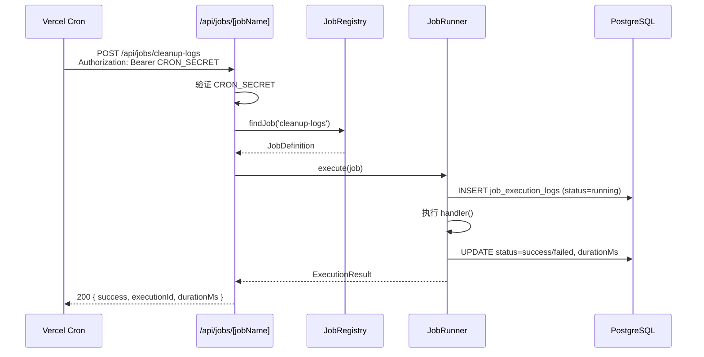
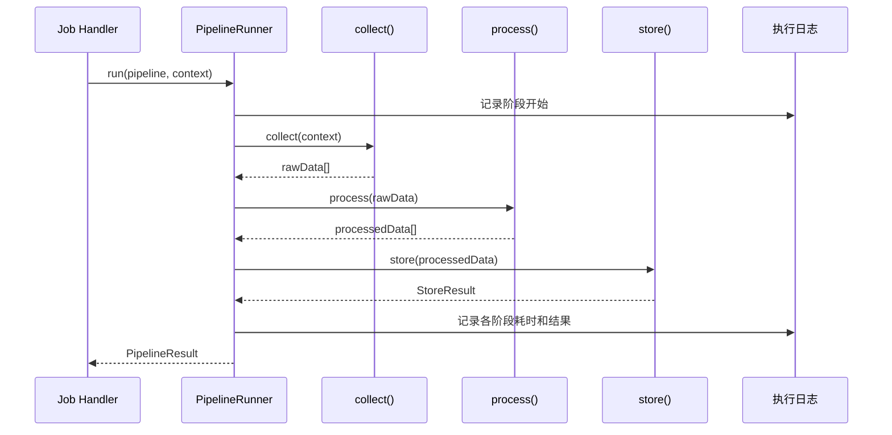

# 设计文档：Background Jobs / Cron

## 概述

本功能为 ShipFree 模板引入后台任务基础设施，延续现有适配器模式（支付、邮件），以相同的结构封装定时任务运行时。目标用户是使用模板构建 SaaS 产品的开发者，核心价值是让他们开箱即得可切换运行时的定时任务框架、通用数据管道骨架和可查询的执行日志。

本设计引入三个相互独立但协作的子系统：**任务调度器**（`src/lib/jobs/`）、**数据管道**（`src/lib/jobs/pipeline/`）和**执行日志**（数据库表 + API 端点）。设计遵循现有代码规范：服务端优先、适配器隔离、环境变量集中注册、Drizzle Schema 单文件管理。

### 目标
- 通过环境变量 `CRON_PROVIDER` 在 node-cron 和 Vercel Cron Jobs 之间无缝切换
- 提供三段式数据管道（collect → process → store）的可复用骨架
- 将所有任务执行记录持久化到 PostgreSQL，支持过滤查询和自动清理

### 非目标
- 不提供分布式任务队列（BullMQ、Redis Queue 等超出模板范围）
- 不提供任务优先级或并发限制机制
- 不提供 Web UI 管理界面（仅 API）
- 不支持动态创建/修改任务（任务在代码中静态注册）

---

## 架构

### 架构模式与边界

延续支付适配器的策略模式：`JobSchedulerAdapter` 接口定义统一合约，`NodeCronAdapter` 和 `VercelCronAdapter` 分别实现。`JobRegistry` 作为单例管理所有已注册任务，`JobRunner` 负责执行并写入日志。

```mermaid
graph TD
  subgraph 配置层
    ENV[env.ts<br/>CRON_PROVIDER / CRON_SECRET]
  end

  subgraph 任务框架 src/lib/jobs/
    REGISTRY[JobRegistry<br/>注册 & 查找任务]
    SERVICE[job-service.ts<br/>单例工厂]
    RUNNER[JobRunner<br/>执行 + 日志写入]
    TYPES[types.ts<br/>接口定义]
    subgraph 适配器
      NC[NodeCronAdapter]
      VC[VercelCronAdapter]
    end
    subgraph 内置任务 built-in/
      CLEANUP[cleanup-logs.ts]
      EXAMPLE[example-stats.ts]
    end
    subgraph 数据管道 pipeline/
      PIPE[Pipeline 接口]
      RUNNER2[PipelineRunner]
    end
  end

  subgraph API 层 src/app/api/jobs/
    TRIGGER[/api/jobs/[jobName]/route.ts<br/>POST 触发端点]
    LOGS[/api/jobs/logs/route.ts<br/>GET 日志查询]
  end

  subgraph 数据库
    SCHEMA[schema.ts<br/>jobExecutionLogs 表]
  end

  ENV --> SERVICE
  SERVICE --> NC & VC
  REGISTRY --> RUNNER
  RUNNER --> SCHEMA
  TRIGGER --> REGISTRY
  TRIGGER --> RUNNER
  LOGS --> SCHEMA
  RUNNER2 --> RUNNER
```

### 技术栈

| 层级 | 选型 | 角色 | 备注 |
|------|------|------|------|
| 任务调度（本地） | node-cron ^3.x | 进程内 cron 调度 | 仅在非 Vercel 环境启用 |
| 任务调度（云端） | Vercel Cron Jobs | HTTP 触发 | 通过 `vercel.json` 配置 |
| 持久化 | PostgreSQL + Drizzle ORM | 执行日志存储 | 复用现有数据库连接 |
| 运行时 | Bun / Node.js | 服务端执行 | 不引入 Worker Threads |
| 类型安全 | TypeScript + Zod | 接口契约 & 环境变量验证 | 遵循现有规范 |
| 错误监控 | Sentry（可选） | 任务失败上报 | 有 `SENTRY_DSN` 时启用 |

---

## 系统流程

### Vercel Cron 触发流程



### 数据管道执行流程



---

## 需求追踪

| 需求 | 摘要 | 组件 | 接口 | 流程 |
|------|------|------|------|------|
| 1 | 定时任务框架 | JobRegistry, NodeCronAdapter, VercelCronAdapter | JobSchedulerAdapter | 调度流程 |
| 2 | Vercel Cron 端点 | /api/jobs/[jobName] | JobTriggerAPI | Vercel 触发流程 |
| 3 | 数据管道模板 | Pipeline 接口, PipelineRunner | PipelineInterface | 数据管道执行流程 |
| 4 | 任务执行日志 | JobRunner, jobExecutionLogs 表 | LogsQueryAPI | 两个流程都涉及 |
| 5 | 开发者体验 | env.ts, schema.ts | - | - |

---

## 组件与接口

### 组件摘要

| 组件 | 层级 | 意图 | 需求覆盖 | 关键依赖 |
|------|------|------|----------|----------|
| JobRegistry | 服务层 | 注册和查找任务定义 | 1, 2 | types.ts |
| NodeCronAdapter | 服务层 | node-cron 驱动实现 | 1 | node-cron |
| VercelCronAdapter | 服务层 | Vercel HTTP 触发实现 | 1, 2 | - |
| JobRunner | 服务层 | 执行任务并写入日志 | 4 | Drizzle, Sentry |
| PipelineRunner | 服务层 | 运行三段式数据管道 | 3 | JobRunner |
| /api/jobs/[jobName] | API 层 | 接受 HTTP 触发 | 2 | JobRegistry, JobRunner |
| /api/jobs/logs | API 层 | 查询执行日志 | 4 | Drizzle |
| jobExecutionLogs | 数据层 | 持久化执行记录 | 4, 5 | PostgreSQL |

---

### 服务层 src/lib/jobs/

#### types.ts

| 字段 | 详情 |
|------|------|
| 意图 | 定义所有核心接口和类型，是整个模块的合约文件 |
| 需求 | 1, 2, 3, 4 |

**核心类型契约**

```typescript
// 任务定义
export interface JobDefinition {
  name: string           // 唯一 slug，用于路由匹配和日志
  schedule: string       // Cron 表达式（标准 5 段）
  description?: string
  handler: JobHandler
  timeoutMs?: number     // 默认 30000ms
}

export type JobHandler = (context: JobContext) => Promise<void>

export interface JobContext {
  jobName: string
  executionId: string
  startedAt: Date
  logger: JobLogger
}

export interface JobLogger {
  info(message: string, meta?: Record<string, unknown>): void
  warn(message: string, meta?: Record<string, unknown>): void
  error(message: string, error?: unknown): void
}

// 执行结果
export interface ExecutionResult {
  success: boolean
  executionId: string
  jobName: string
  durationMs: number
  error?: string
}

// 调度器适配器接口
export interface JobSchedulerAdapter {
  readonly provider: CronProvider
  start(registry: JobRegistry): Promise<void>
  stop(): Promise<void>
}

export type CronProvider = 'node-cron' | 'vercel'

// 数据管道接口
export interface Pipeline<TInput, TOutput> {
  collect(context: JobContext): Promise<TInput[]>
  process(data: TInput[], context: JobContext): Promise<TOutput[]>
  store(data: TOutput[], context: JobContext): Promise<{ stored: number }>
}

export interface PipelineRunResult {
  collected: number
  processed: number
  stored: number
  stageDurations: { collect: number; process: number; store: number }
}
```

#### job-service.ts（单例工厂）

| 字段 | 详情 |
|------|------|
| 意图 | 根据 `CRON_PROVIDER` 环境变量返回适配器单例，自动检测运行环境 |
| 需求 | 1 |

**服务接口**

```typescript
interface JobServiceInterface {
  getAdapter(): JobSchedulerAdapter
  getRegistry(): JobRegistry
  startScheduler(): Promise<void>
}
```

- 前置条件：`env.CRON_PROVIDER` 已在 `src/config/env.ts` 注册
- 后置条件：返回确定性适配器，不重复创建实例
- 不变量：在服务端模块初始化期间只调用一次 `start()`

**自动检测逻辑**：若 `CRON_PROVIDER` 未设置，检测 `process.env.VERCEL` 是否存在，存在则选 `vercel`，否则选 `node-cron`。

**批次/任务契约**：
- 触发：进程启动时（node-cron）或 HTTP POST（vercel）
- 幂等性：每次执行写入独立日志行，不去重
- 恢复：执行失败后下次调度重新触发，无自动重试

#### JobRunner

| 字段 | 详情 |
|------|------|
| 意图 | 包裹任务 handler，处理超时、错误捕获、日志写入和 Sentry 上报 |
| 需求 | 4 |

**服务接口**

```typescript
interface JobRunnerService {
  execute(job: JobDefinition): Promise<ExecutionResult>
}
```

- 前置条件：数据库可用
- 后置条件：`job_execution_logs` 中存在对应执行记录，status 为终态
- 超时处理：用 `Promise.race` + `setTimeout` 实现，超时后 status 设为 `timeout`

#### PipelineRunner

| 字段 | 详情 |
|------|------|
| 意图 | 按顺序执行 collect → process → store，记录各阶段耗时，错误在阶段级捕获 |
| 需求 | 3 |

**服务接口**

```typescript
interface PipelineRunnerService {
  run<TInput, TOutput>(
    pipeline: Pipeline<TInput, TOutput>,
    context: JobContext
  ): Promise<PipelineRunResult>
}
```

---

### API 层 src/app/api/jobs/

#### /api/jobs/[jobName]/route.ts

| 字段 | 详情 |
|------|------|
| 意图 | 接受 POST 请求触发指定任务，验证 `CRON_SECRET` |
| 需求 | 2 |

**API 契约**

| 方法 | 端点 | 请求 | 响应 | 错误 |
|------|------|------|------|------|
| POST | /api/jobs/[jobName] | `Authorization: Bearer <CRON_SECRET>` | `ExecutionResult` | 401, 404, 500 |

鉴权逻辑：
- 生产环境：必须携带 `Authorization: Bearer ${CRON_SECRET}` header，否则 401
- 开发环境（`NODE_ENV=development`）：`CRON_SECRET` 未配置时允许无鉴权访问，并写入 `console.warn`

#### /api/jobs/logs/route.ts

| 字段 | 详情 |
|------|------|
| 意图 | 分页查询任务执行日志，支持多维度过滤 |
| 需求 | 4 |

**API 契约**

| 方法 | 端点 | Query Params | 响应 | 错误 |
|------|------|--------------|------|------|
| GET | /api/jobs/logs | `jobName?`, `status?`, `from?`, `to?`, `page?`, `limit?` | `{ data: Log[], total, page }` | 400, 500 |

---

## 数据模型

### 领域模型

核心聚合：**JobExecutionLog**——每次任务执行对应一条记录，从 `running` 状态流转到 `success` / `failed` / `timeout`。无需关联到 `user` 表（系统级任务），因此不参与用户级联删除。

### 物理数据模型

**新增表：`job_execution_logs`**

```typescript
// src/database/schema.ts 新增
export const jobExecutionLogs = pgTable(
  'job_execution_logs',
  {
    id: text('id').primaryKey(),                          // nanoid 生成
    jobName: text('job_name').notNull(),
    status: text('status').notNull()                      // pending|running|success|failed|timeout
      .$type<'pending' | 'running' | 'success' | 'failed' | 'timeout'>(),
    startedAt: timestamp('started_at').defaultNow().notNull(),
    finishedAt: timestamp('finished_at'),
    durationMs: integer('duration_ms'),
    errorMessage: text('error_message'),                  // 最多 2000 字符
    metadata: jsonb('metadata'),                          // 各阶段耗时等扩展数据
    createdAt: timestamp('created_at').defaultNow().notNull(),
  },
  (table) => [
    index('job_execution_logs_job_name_idx').on(table.jobName),
    index('job_execution_logs_started_at_idx').on(table.startedAt),
    index('job_execution_logs_status_idx').on(table.status),
  ]
)
```

**索引策略**：
- `job_name` 索引：按任务名筛选日志
- `started_at` 索引：时间范围查询 + 清理任务（`WHERE started_at < now() - INTERVAL`）
- `status` 索引：按状态筛选失败任务

**无外键约束**：`job_execution_logs` 是独立系统日志，不引用 `user` 表，不参与级联删除。

### 数据保留

清理任务（`cleanup-logs`）执行 SQL：
```sql
DELETE FROM job_execution_logs
WHERE started_at < NOW() - INTERVAL '30 days'  -- JOB_LOG_RETENTION_DAYS 控制天数
```

---

## 错误处理

### 错误策略

所有执行错误在 `JobRunner` 层统一捕获，确保错误不向上传播导致进程崩溃。

### 错误分类与响应

**任务超时**：`Promise.race` 竞争，超时后将 status 设为 `timeout`，`errorMessage` 写入 `"Task timed out after Xms"`，Sentry 上报为 warning 级别。

**任务执行异常**：捕获 `Error` 对象，status 设为 `failed`，`errorMessage` 写入 `error.message`（截断 2000 字符），stack 写入 metadata，Sentry 上报为 error 级别。

**数据管道阶段失败**：阶段级 try/catch，失败时记录阶段名到 metadata，终止后续阶段，将整体 status 设为 `failed`。

**HTTP 端点错误**：
- 404 → 任务名不存在
- 401 → 鉴权失败
- 500 → 任务执行时内部错误（已写入日志，返回 `{ success: false, error: 'Internal error' }`）

### 监控

- 有 `SENTRY_DSN` 时：任务失败/超时通过 `Sentry.captureException` 上报，tag `job_name`
- 无 Sentry：错误写入 `console.error`，始终写入数据库日志

---

## 测试策略

### 单元测试
- `JobRunner`：mock 数据库，验证 status 流转（running → success / failed / timeout）
- `PipelineRunner`：mock pipeline 三个方法，验证顺序执行和阶段错误捕获
- `job-service.ts`：验证自动检测逻辑（mock `process.env.VERCEL`）
- `NodeCronAdapter`：mock node-cron，验证任务注册和启停

### 集成测试
- `/api/jobs/[jobName]` 端点：有效 token → 200，无效 token → 401，不存在任务 → 404
- `/api/jobs/logs` 端点：验证过滤参数和分页逻辑
- `cleanup-logs` 任务：插入过期记录，执行清理，验证 DB 行为

### 性能测试
- 日志写入不应超过任务执行时间的 5%（DB round-trip < 50ms）
- 日志查询（10 万行内）P95 响应时间 < 200ms

---

## 安全考量

- `CRON_SECRET` 作为 Bearer token，最小长度 32 字符（Zod `.min(32)` 校验，生产环境必填）
- 任务名（jobName）从注册表查找，不直接拼接到 SQL，防止注入
- `/api/jobs/logs` 端点建议添加 Better-Auth session 校验（限 dashboard 用户访问），作为可选增强

---

## 性能与可扩展性

- `jobExecutionLogs` 表单独维护，不影响核心业务表查询性能
- 清理任务每日自动删除过期记录，控制表大小
- node-cron 模式下任务在主进程内执行——适合轻量任务；重型任务（>30s）应使用 Vercel Cron + 独立端点

---

## 环境变量新增

| 变量 | 类型 | 默认值 | 说明 |
|------|------|--------|------|
| `CRON_PROVIDER` | `'node-cron' \| 'vercel'` | 自动检测 | 定时任务运行时 |
| `CRON_SECRET` | `string` | 无 | HTTP 触发端点鉴权密钥，生产环境必填 |
| `JOB_LOG_RETENTION_DAYS` | `number` | `30` | 日志保留天数 |
