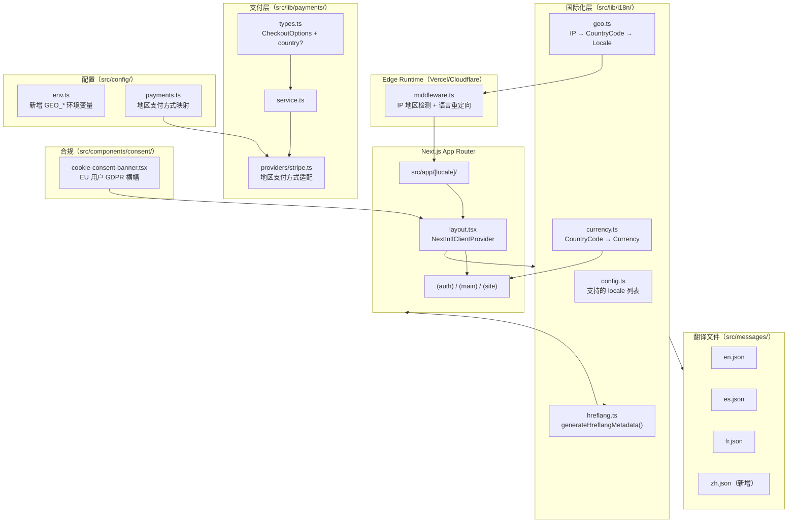
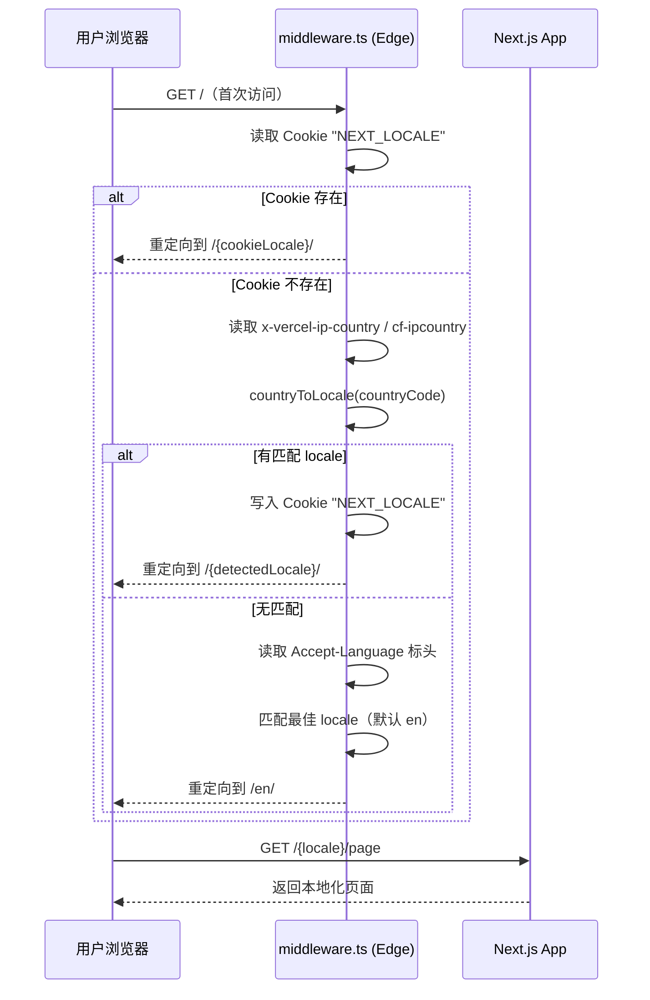
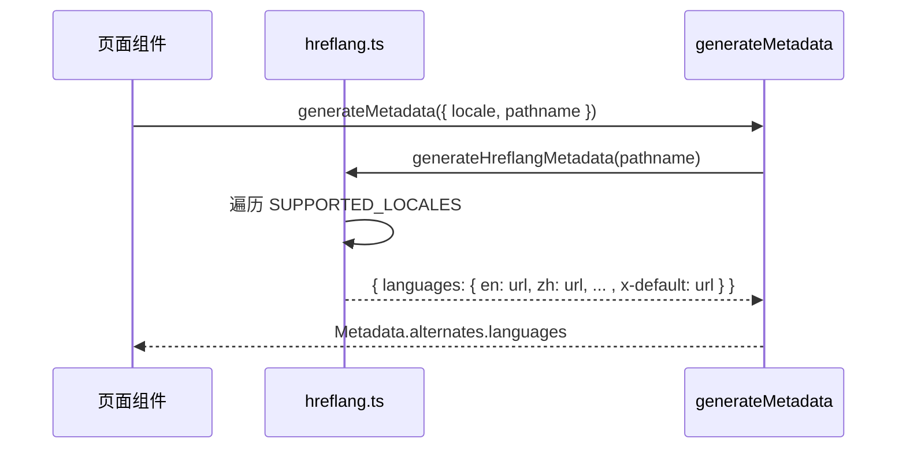

# 设计文档

## 概述

本功能为 ShipFree SaaS 模板添加完整的国际化（i18n）扩展与地理位置（Geo）优化能力。目前项目使用 Next.js App Router，但尚未集成 next-intl 或任何 i18n 路由层，所有页面均为单一语言（英文）。

**目标用户**：部署 ShipFree 模板的开发者及其终端用户（尤其是中文用户群体）。

**实现路径**：引入 next-intl，建立 `[locale]` 动态路由段，在 Edge Runtime 中间件中实现 IP 地理位置检测，扩展支付适配器支持地区感知，并在 `generateMetadata` 中注入 hreflang 标签。整体遵循现有适配器模式和 Server Component 优先范式。

### 目标

- 新增简体中文（`zh`）语言支持，与 `en`、`es`、`fr` 并列
- 建立 `模块.组件.元素` 三级翻译 key 命名规范
- 在 Edge 中间件中实现基于 IP/Accept-Language 的地区自动检测
- 货币本地化展示（CNY/EUR/GBP/USD）
- 支付方式地区适配（支持支付宝、微信支付等本地方式）
- 所有多语言页面自动生成 hreflang 标签
- CDN 层 `Cache-Control` 与 `Vary` 标头优化
- GDPR Cookie 同意横幅（针对 EU 用户）

### 非目标

- 繁体中文（zh-TW）单独支持（使用同一 `zh` locale）
- 机器翻译自动化流程
- 自建 IP 数据库（依赖平台标头）
- 支付宝/微信支付的自主接入（依赖 Stripe 官方集成）
- 多租户组织级别的语言偏好管理

---

## 架构

### 现有架构分析

- **路由**：当前为 `src/app/(auth|main|site)/` 无 locale 前缀，无 `[locale]` 路由段
- **国际化**：package.json 中无 next-intl 依赖，需全新引入
- **中间件**：无 `middleware.ts`，需新建
- **SEO**：`src/lib/seo.ts` 的 `generateMetadata` 已有 `alternates.canonical`，需扩展 `alternates.languages`
- **支付**：`PaymentAdapter.createCheckout(options: CheckoutOptions)` 的 `CheckoutOptions` 需扩展地区字段
- **环境变量**：`src/config/env.ts` 使用 `@t3-oss/env-nextjs` 集中管理

### 架构模式与边界图



### 技术栈

| 层级 | 选型 / 版本 | 功能角色 | 备注 |
|------|------------|---------|------|
| 路由/国际化 | next-intl ^4.x | locale 路由、翻译提取、时区格式化 | 需新增依赖 |
| Edge 中间件 | Next.js Middleware (Edge Runtime) | IP 检测、语言重定向 | 读取 `x-vercel-ip-country` / `cf-ipcountry` |
| 格式化 | `Intl.NumberFormat` (内置) | 货币本地化展示 | 无需额外依赖 |
| Cookie 同意 | 自研轻量组件 | GDPR 横幅 | 避免引入重型 CMP 库 |
| 支付地区适配 | 扩展现有 Stripe 适配器 | 本地支付方式 | 遵循现有适配器模式 |

---

## 系统流程

### 首次访问语言检测流程



### hreflang 生成流程



---

## 需求追溯

| 需求 | 摘要 | 组件 | 接口 | 流程 |
|------|------|------|------|------|
| 1 | 中文语言支持 | zh.json, NextIntlClientProvider | next-intl API | locale 路由 |
| 2 | 翻译 Key 规范 | 所有 *.json | 无 API | 开发约定 |
| 3 | IP 地区检测 | middleware.ts, geo.ts | countryToLocale() | 首次访问流程 |
| 4 | 货币本地化 | currency.ts, 定价页面 | formatCurrency() | 页面渲染 |
| 5 | 支付方式适配 | stripe.ts, payments.ts | CheckoutOptions.country | 结算流程 |
| 6 | hreflang 标签 | hreflang.ts, seo.ts | generateHreflangMetadata() | metadata 生成 |
| 7 | CDN 就近分发 | next.config.ts, vercel.json | headers() | 响应标头 |
| 8 | GDPR 合规 | cookie-consent-banner.tsx | ConsentStore | 页面渲染 |

---

## 组件与接口

### 组件汇总

| 组件 | 所属层 | 职责 | 需求覆盖 | 关键依赖 | 契约 |
|------|--------|------|---------|---------|------|
| middleware.ts | Edge | IP 检测 + 语言重定向 | 3 | next-intl, geo.ts | Middleware |
| src/lib/i18n/config.ts | 配置 | locale 常量定义 | 1, 2, 3 | - | Service |
| src/lib/i18n/geo.ts | 服务 | countryCode → locale 映射 | 3 | - | Service |
| src/lib/i18n/currency.ts | 服务 | locale/country → 货币格式化 | 4 | Intl.NumberFormat | Service |
| src/lib/i18n/hreflang.ts | 服务 | hreflang metadata 生成 | 6 | i18n/config | Service |
| src/messages/zh.json | 翻译数据 | 中文翻译键值对 | 1, 2 | - | State |
| src/app/[locale]/layout.tsx | UI | NextIntlClientProvider 注入 | 1 | next-intl | - |
| src/components/consent/cookie-consent-banner.tsx | UI | GDPR Cookie 横幅 | 8 | Zustand | State |
| src/config/payments.ts（扩展） | 配置 | 地区支付方式映射 | 5 | - | Service |
| src/lib/payments/types.ts（扩展） | 类型 | CheckoutOptions.country | 5 | - | API |

---

### 国际化层（src/lib/i18n/）

#### I18nConfig

| 字段 | 详情 |
|------|------|
| 职责 | 定义支持的 locale 列表、默认 locale、locale 与语言标签的映射 |
| 需求覆盖 | 1, 3, 6 |

**服务接口**
```typescript
// src/lib/i18n/config.ts
export const SUPPORTED_LOCALES = ['en', 'es', 'fr', 'zh'] as const
export type SupportedLocale = (typeof SUPPORTED_LOCALES)[number]
export const DEFAULT_LOCALE: SupportedLocale = 'en'

// locale → IETF BCP 47 语言标签（用于 hreflang）
export const LOCALE_TO_LANG_TAG: Record<SupportedLocale, string> = {
  en: 'en',
  es: 'es',
  fr: 'fr',
  zh: 'zh-Hans',
}
```

#### GeoService

| 字段 | 详情 |
|------|------|
| 职责 | 将 ISO 3166-1 国家代码映射到支持的 locale，供中间件调用 |
| 需求覆盖 | 3 |

**服务接口**
```typescript
// src/lib/i18n/geo.ts
export const COUNTRY_TO_LOCALE: Partial<Record<string, SupportedLocale>> = {
  CN: 'zh', TW: 'zh', HK: 'zh', MO: 'zh',
  ES: 'es', MX: 'es', AR: 'es', CO: 'es',
  FR: 'fr', BE: 'fr', CH: 'fr', CA: 'fr',
  // ... 其他映射
}

export function countryToLocale(countryCode: string | null): SupportedLocale {
  if (!countryCode) return DEFAULT_LOCALE
  return COUNTRY_TO_LOCALE[countryCode.toUpperCase()] ?? DEFAULT_LOCALE
}

export function getCountryFromRequest(request: Request): string | null {
  return (
    request.headers.get('x-vercel-ip-country') ??
    request.headers.get('cf-ipcountry') ??
    null
  )
}
```

- 前置条件：`request` 为 Next.js Middleware 的 `NextRequest`
- 后置条件：返回 `SupportedLocale`，永不抛出异常
- 不变式：原始 IP 地址不记录、不持久化

#### CurrencyService

| 字段 | 详情 |
|------|------|
| 职责 | 根据 locale/countryCode 确定货币代码，并格式化金额显示 |
| 需求覆盖 | 4 |

**服务接口**
```typescript
// src/lib/i18n/currency.ts
export type CurrencyCode = 'USD' | 'CNY' | 'EUR' | 'GBP'

export function getCurrencyForLocale(locale: SupportedLocale, countryCode?: string): CurrencyCode {
  if (countryCode === 'CN') return 'CNY'
  if (locale === 'zh') return 'CNY'
  // EU 国家 → EUR
  if (EU_COUNTRIES.has(countryCode ?? '')) return 'EUR'
  if (countryCode === 'GB') return 'GBP'
  return 'USD'
}

export function formatCurrency(amount: number, currency: CurrencyCode, locale: SupportedLocale): string {
  return new Intl.NumberFormat(LOCALE_TO_LANG_TAG[locale], {
    style: 'currency',
    currency,
    minimumFractionDigits: 2,
  }).format(amount / 100)
}
```

#### HreflangService

| 字段 | 详情 |
|------|------|
| 职责 | 为给定路径生成包含所有 locale 的 hreflang metadata 对象 |
| 需求覆盖 | 6 |

**服务接口**
```typescript
// src/lib/i18n/hreflang.ts
export function generateHreflangMetadata(pathname: string): Metadata['alternates'] {
  const baseUrl = env.NEXT_PUBLIC_APP_URL.replace(/\/$/, '')
  const languages: Record<string, string> = {}

  for (const locale of SUPPORTED_LOCALES) {
    const langTag = LOCALE_TO_LANG_TAG[locale]
    languages[langTag] = `${baseUrl}/${locale}${pathname}`
  }
  // x-default 指向英文版
  languages['x-default'] = `${baseUrl}/en${pathname}`

  return { languages }
}
```

---

### 中间件层

#### middleware.ts

| 字段 | 详情 |
|------|------|
| 职责 | 在 Edge 运行时拦截请求，检测语言，重定向到正确 locale 路径，设置 Cookie |
| 需求覆盖 | 3, 7 |

**实现约束**
- 使用 next-intl 的 `createMiddleware` 作为路由处理基础
- 在 `createMiddleware` 之前注入自定义 `localeDetection` 逻辑（读取平台 Geo 标头）
- Cookie 名称：`NEXT_LOCALE`，`Max-Age: 31536000`（1 年），`SameSite: Lax`
- 不写入 IP 地址到任何持久存储（需求 8.5）

**匹配规则（middleware matcher）**
```typescript
export const config = {
  matcher: ['/((?!api|_next/static|_next/image|favicon.ico|monitoring).*)'],
}
```

---

### UI 层

#### NextIntlClientProvider（src/app/[locale]/layout.tsx）

将 next-intl 的 Provider 注入到 locale 路由段的布局中，使客户端组件可用 `useTranslations`。

#### CookieConsentBanner

| 字段 | 详情 |
|------|------|
| 职责 | 检测用户是否来自 EU 地区，展示 GDPR Cookie 同意横幅 |
| 需求覆盖 | 8.1, 8.6 |

**状态管理（Zustand）**
```typescript
// src/lib/consent/store.ts
interface ConsentStore {
  status: 'pending' | 'accepted' | 'rejected' | 'partial'
  categories: {
    necessary: true      // 始终为 true，不可拒绝
    analytics: boolean
    marketing: boolean
  }
  setConsent(categories: Partial<ConsentStore['categories']>): void
  loadFromCookie(): void
}
```

**API 契约**

| 方法 | 端点 | 请求 | 响应 | 错误 |
|------|------|------|------|------|
| POST | /api/consent | `{ analytics: boolean, marketing: boolean }` | `{ ok: true }` | 400 |

- 同意状态持久化到 Cookie（`consent_preferences`），不写入数据库

---

### 支付层扩展

#### CheckoutOptions 扩展

```typescript
// src/lib/payments/types.ts（扩展）
export interface CheckoutOptions {
  // ... 现有字段 ...
  country?: string        // ISO 3166-1 国家代码，用于地区支付方式适配
  currency?: CurrencyCode // 偏好货币（适配器可忽略不支持的货币）
}
```

#### 地区支付方式配置

```typescript
// src/config/payments.ts（新增）
export const REGIONAL_PAYMENT_METHODS: Record<string, string[]> = {
  CN: ['alipay', 'wechat_pay'],
  NL: ['ideal'],
  DE: ['sepa_debit'],
  // EU 通用
  EU: ['sepa_debit'],
}
```

Stripe 适配器在 `createCheckout` 时根据 `options.country` 查询 `REGIONAL_PAYMENT_METHODS`，将匹配的方式追加到 `payment_method_types`。

---

## 数据模型

### 域模型

- **Locale**：值对象，枚举类型，4 个成员（en/es/fr/zh）
- **CountryCode**：值对象，ISO 3166-1 alpha-2 字符串
- **CurrencyCode**：值对象，ISO 4217 字符串
- **ConsentPreferences**：值对象，持久化到 Cookie，不入库

### 逻辑数据模型

无新增数据库表。Cookie 数据结构：

```
NEXT_LOCALE: "zh"            // 语言偏好
consent_preferences: {        // GDPR 同意状态（JSON，base64 编码）
  necessary: true,
  analytics: false,
  marketing: false,
  updatedAt: "2026-03-26T..."
}
```

---

## 错误处理

### 错误策略

- **IP 检测失败**：无匹配 → 降级到 `en`，不抛出异常（需求 3.4）
- **缺少翻译 key**：next-intl 自动降级到 `en` 翻译，开发环境打印警告
- **货币不支持**：降级到 USD 并在 UI 显示提示（需求 4.6）
- **Cookie 读写失败**：静默降级，不影响页面渲染

### 监控

- 中间件错误通过 Sentry 捕获（现有 `@sentry/nextjs` 集成）
- 翻译 key 缺失在构建时通过 next-intl 类型检查发现

---

## 测试策略

### 单元测试

- `countryToLocale()`：覆盖 CN/TW/HK → zh，EU 国家 → en/fr，未知代码 → en
- `getCurrencyForLocale()`：覆盖 CN → CNY，EU → EUR，GB → GBP，默认 → USD
- `formatCurrency()`：验证 `Intl.NumberFormat` 各 locale 输出格式
- `generateHreflangMetadata()`：验证 URL 结构、x-default 指向、所有 locale 覆盖

### 集成测试

- 中间件重定向：首次访问根路径 → 正确 locale 重定向
- Cookie 优先级：存在 Cookie 时不触发 IP 检测
- 支付流程：`CheckoutOptions.country = 'CN'` 时 Stripe 适配器包含 `alipay`
- hreflang 标签：`/en/pricing` 页面的 metadata 包含所有 4 个 locale 的 alternate link

### E2E 测试

- 中文用户访问路径：`/zh/` → 所有 UI 文本为中文
- 语言切换器：切换 locale 后 Cookie 写入，刷新后保持该 locale
- GDPR 横幅：EU 用户首次访问显示横幅，接受后不再显示

---

## 安全考量

- **IP 隐私**：仅使用国家代码（country code），原始 IP 不写入日志或数据库
- **Cookie 安全**：`NEXT_LOCALE` 设置 `SameSite=Lax`；`consent_preferences` 内容不含敏感信息
- **GDPR**：同意状态在用户明确操作前不加载第三方脚本（需求 8.1）
- **XSS**：翻译内容通过 next-intl 的 `rich()` 渲染时不使用 `dangerouslySetInnerHTML`

---

## 性能与可扩展性

- **Edge 执行**：中间件在 Edge Runtime 执行，无冷启动延迟
- **缓存策略**：翻译 JSON 文件设置 `Cache-Control: public, max-age=3600, stale-while-revalidate=86400`
- **Vary 标头**：国际化页面响应添加 `Vary: Accept-Language` 防止 CDN 混缓存
- **Bundle 大小**：翻译文件按 locale 按需加载（next-intl 默认行为）

---

## 迁移策略

1. **Phase 1（无破坏性）**：添加 next-intl 依赖，创建 `src/lib/i18n/` 和翻译文件，不改动现有路由
2. **Phase 2（路由迁移）**：将 `src/app/(auth|main|site)/` 移入 `src/app/[locale]/`，添加 middleware.ts
3. **Phase 3（集成完善）**：扩展支付适配器、添加 hreflang、添加合规横幅
4. **回滚触发**：若 Phase 2 路由迁移导致构建失败，回退到 Phase 1 状态（纯添加，无删除）
