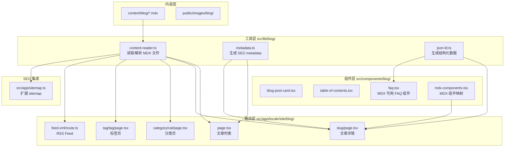
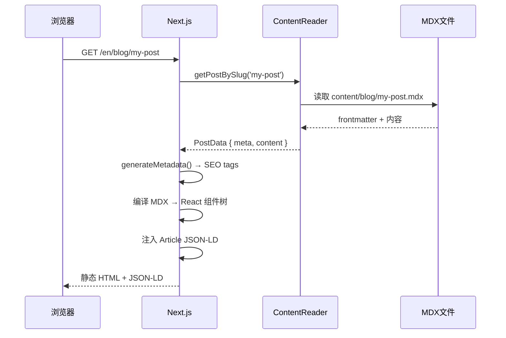
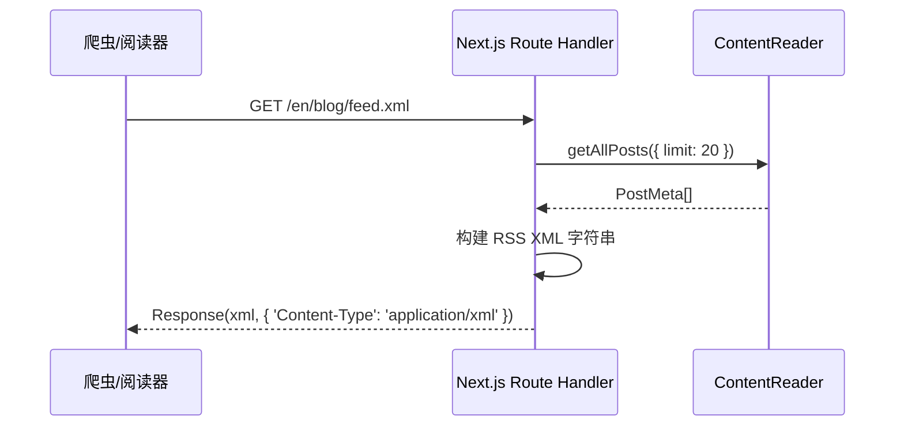

# 设计文档：SEO 博客系统

## 概述

SEO 博客系统为 ShipFree 模板提供基于文件系统的 MDX 博客引擎，实现零数据库依赖的内容管理。该系统充分利用 Next.js App Router 的静态生成能力，在构建时将 MDX 文件编译为高性能的静态 HTML 页面，同时通过 JSON-LD 结构化数据和 FAQ 组件实现 SEO 与 GEO（AI 引擎优化）双重价值。

博客内容通过 `content/blog/` 目录下的 MDX 文件管理，frontmatter 定义元数据，正文支持 React 组件嵌入。所有博客路由集成在现有的 `src/app/[locale]/(site)/blog/` 路由结构中，与国际化系统无缝衔接。

**用户群体：** 开发者（快速启动博客）和访客（阅读/订阅内容）将通过文章列表、详情、分类/标签页面访问博客，RSS feed 支持阅读器订阅。

### 目标

- 零数据库依赖，MDX 文件即内容源
- 构建时静态生成，最大化 Core Web Vitals 性能
- JSON-LD 结构化数据覆盖文章、博客列表、FAQ 三种类型
- FAQ 组件可复用于 MDX 文章和营销页面，SEO/GEO 双重价值
- 与现有国际化、路由、组件库无缝集成

### 非目标

- 不提供 CMS 管理界面（内容管理直接编辑 MDX 文件）
- 不提供评论系统（可后续通过第三方服务集成）
- 不实现博客文章的多语言翻译（文章内容使用单一语言）
- 不实现增量静态再生（ISR），静态构建已满足博客场景
- 不提供全文搜索（超出当前范围）

## 架构

### 现有架构分析

项目已有 `src/app/(site)/` 路由组承载营销页面，`src/app/[locale]/` 暂未实际使用（文件树中无 locale 路由，实际页面直接在 `src/app/(site)/` 下）。需确认路由结构：检查 `next.config.ts` 中的 `next-intl` 配置，博客路由应遵循与营销页面一致的模式。

现有 `src/app/(site)/faq.tsx` 使用 Accordion 组件实现了站点级 FAQ，但没有 JSON-LD 注入能力。新的 `<BlogFAQ>` 组件将其增强为支持结构化数据的可复用 MDX 组件。

### 架构模式与边界图



**架构集成：**
- 选用模式：文件系统 + 静态生成（无数据库，构建时读取 MDX）
- 领域边界：`src/lib/blog/` 封装所有内容读取逻辑，路由层只调用工具函数
- 保留现有模式：Server Components 优先，国际化路由，`cn()` 样式工具
- 新增组件理由：`BlogFAQ` 需要注入 JSON-LD，复用但增强现有 FAQ 模式

### 技术栈

| 层级 | 选择 | 在本功能中的作用 | 备注 |
|------|------|-----------------|------|
| 内容 | MDX + gray-matter | 解析 frontmatter + MDX 内容 | 已是 Next.js 生态标配 |
| MDX 渲染 | next-mdx-remote 或 @next/mdx | 编译 MDX 为 React 组件 | 优先 next-mdx-remote（支持动态路径） |
| 代码高亮 | rehype-highlight 或 shiki | MDX 代码块语法高亮 | rehype-highlight 体积更小 |
| 目录提取 | rehype-slug + rehype-autolink-headings | 为标题自动添加锚点 | 配合 remark-toc 生成目录 |
| RSS | 原生 Response API | 生成 XML RSS feed | 无需额外库 |
| JSON-LD | 内联 script 标签 | 注入结构化数据 | Next.js Script 组件或 `<script type="application/ld+json">` |
| 样式 | TailwindCSS + Typography 插件 | MDX 正文排版 | `@tailwindcss/typography` prose 类 |

## 系统流程

### 文章页面请求流程



### RSS Feed 生成流程



## 需求追溯

| 需求 | 摘要 | 组件 | 接口 | 流程 |
|------|------|------|------|------|
| 1 | MDX 内容管理 | ContentReader, MDXComponents | `getPostBySlug`, `getAllPosts` | 文章请求流程 |
| 2 | 文章列表页 | BlogListPage, BlogPostCard | `getAllPosts` | — |
| 3 | 文章详情页 | BlogDetailPage, TOC | `getPostBySlug` | 文章请求流程 |
| 4 | 分类/标签 | CategoryPage, TagPage | `getPostsByCategory`, `getPostsByTag`, `getAllTaxonomies` | — |
| 5 | RSS Feed | RssRouteHandler | `getAllPosts` | RSS 流程 |
| 6 | JSON-LD | JsonLdScript, BlogDetailPage | `generateArticleJsonLd` | 文章请求流程 |
| 7 | FAQ 组件 | BlogFAQ | `FAQItem[]` props | — |
| 8 | Sitemap | sitemap.ts | `getAllPosts` | — |
| 9 | 国际化 | 所有页面 | next-intl `getTranslations` | — |

## 组件与接口

### 组件总览

| 组件 | 层级 | 职责 | 需求覆盖 | 关键依赖 | 契约 |
|------|------|------|----------|----------|------|
| ContentReader | lib/blog | 读取/解析所有 MDX 文件 | 1,2,3,4,5,8 | gray-matter, fs | Service |
| BlogListPage | app/[locale]/(site)/blog | 文章列表路由页面 | 2,9 | ContentReader | — |
| BlogDetailPage | app/[locale]/(site)/blog/[slug] | 文章详情路由页面 | 3,6,9 | ContentReader, JsonLdScript | — |
| CategoryPage | app/...blog/category/[category] | 分类筛选页 | 4,9 | ContentReader | — |
| TagPage | app/...blog/tag/[tag] | 标签筛选页 | 4,9 | ContentReader | — |
| RssRouteHandler | app/[locale]/blog/feed.xml | RSS XML 路由 | 5 | ContentReader | API |
| BlogPostCard | components/blog | 文章卡片 UI | 2,4 | — | — |
| TableOfContents | components/blog | 目录导航 | 3 | — | — |
| BlogFAQ | components/blog | FAQ + JSON-LD | 7 | Accordion (ui) | Service |
| MDXComponents | components/blog | MDX 组件映射 | 1,7 | BlogFAQ, ui/* | — |
| JsonLdScript | components/blog | JSON-LD 注入 | 6 | — | — |

### 工具层（src/lib/blog/）

#### ContentReader

| 字段 | 详情 |
|------|------|
| 职责 | 从文件系统读取、解析、过滤 MDX 博客文章 |
| 需求 | 1, 2, 3, 4, 5, 8 |

**职责与约束**
- 从 `content/blog/` 目录读取所有 `.mdx` 文件
- 解析 frontmatter（gray-matter）并过滤 `published: false` 的文章
- 按 `date` 字段倒序排序
- 仅在服务端执行（Node.js `fs` 模块，不暴露到客户端）

**依赖**
- 入站：所有博客路由页面 — 读取内容（关键）
- 出站：`content/blog/*.mdx` 文件系统 — 内容源（关键）
- 外部：`gray-matter` — frontmatter 解析（关键）；`next-mdx-remote/rsc` — MDX 编译（关键）

**契约：** Service [x]

##### 服务接口

```typescript
export interface PostMeta {
  slug: string
  title: string
  description: string
  date: string          // ISO 8601
  author: string
  categories: string[]
  tags: string[]
  coverImage?: string
  published: boolean
}

export interface Post extends PostMeta {
  content: string       // 原始 MDX 字符串，供 next-mdx-remote 编译
}

export interface BlogContentReader {
  getAllPosts(options?: { limit?: number; offset?: number }): PostMeta[]
  getPostBySlug(slug: string): Post | null
  getPostsByCategory(category: string): PostMeta[]
  getPostsByTag(tag: string): PostMeta[]
  getAllCategories(): string[]
  getAllTags(): string[]
}
```

- 前置条件：`content/blog/` 目录存在（可为空）
- 后置条件：返回的 PostMeta 列表仅包含 `published: true` 的文章，按 date 倒序
- 不变量：slug 由文件名（不含 `.mdx` 扩展名）派生，唯一

#### JsonLdScript

| 字段 | 详情 |
|------|------|
| 职责 | 将 JSON-LD 对象序列化为 `<script type="application/ld+json">` 标签并注入 `<head>` |
| 需求 | 6, 7 |

**契约：** Service [x]

##### 服务接口

```typescript
// src/lib/blog/json-ld.ts
export interface ArticleJsonLd {
  type: 'BlogPosting'
  title: string
  description: string
  author: string
  datePublished: string
  dateModified?: string
  image?: string
  url: string
}

export interface FaqJsonLd {
  type: 'FAQPage'
  questions: Array<{ question: string; answer: string }>
}

export const generateArticleJsonLd = (data: ArticleJsonLd): object => { /* ... */ }
export const generateFaqJsonLd = (data: FaqJsonLd): object => { /* ... */ }
export const generateBlogJsonLd = (siteUrl: string, blogName: string): object => { /* ... */ }
```

### 组件层（src/components/blog/）

#### BlogFAQ

| 字段 | 详情 |
|------|------|
| 职责 | 可在 MDX 中使用的 FAQ 组件，渲染 Accordion UI 并注入 FAQPage JSON-LD |
| 需求 | 7 |

**职责与约束**
- 接受 `items: FAQItem[]` 和可选的 `mode: 'interactive' | 'static'` props
- `interactive` 模式（默认）：使用 `'use client'` + Accordion 组件
- `static` 模式：纯 Server Component，全部展开，适合 SEO 爬虫优先场景
- 自动注入 `FAQPage` JSON-LD，无需父组件处理

**契约：** Service [x] / State [x]

##### 服务接口

```typescript
export interface FAQItem {
  question: string
  answer: string
}

export interface BlogFAQProps {
  items: FAQItem[]
  mode?: 'interactive' | 'static'
  title?: string
}
```

**实现注意**
- 集成：在 `mdx-components.tsx` 中注册为 `FAQ` 组件，MDX 中使用 `<FAQ items={[...]} />`
- 验证：JSON-LD 数据中 `answer` 字段需转义 HTML 特殊字符
- 风险：`'use client'` 的 interactive 模式无法直接在 Server Component 中注入 `<head>`；解决方案是将 JSON-LD 提取为独立的 Server Component 包裹层

### 路由层（src/app/[locale]/(site)/blog/）

#### BlogListPage

**API 契约**（generateMetadata）：
- title: `"博客 | ${siteName}"`
- description: 站点博客描述
- openGraph: type `website`，image 使用默认 OG 图片
- alternates.types: `{ 'application/rss+xml': '/blog/feed.xml' }`

#### BlogDetailPage

**API 契约**（generateMetadata）：
- title: `"${post.title} | ${siteName}"`
- description: `post.description`
- openGraph: type `article`，image `post.coverImage`
- 注入 Article JSON-LD 通过 `JsonLdScript` 组件

#### RssRouteHandler

##### API 契约

| Method | Endpoint | Request | Response | Errors |
|--------|----------|---------|----------|--------|
| GET | `/[locale]/blog/feed.xml` | — | RSS 2.0 XML | 500 |

响应 Header：`Content-Type: application/xml; charset=utf-8`

## 数据模型

### 领域模型

博客文章是核心聚合根，无需持久化到数据库。文章元数据和内容均来自 MDX 文件。

```
Post (聚合根)
├── slug: string (标识符，文件名派生)
├── meta: PostMeta (值对象)
│   ├── title, description, date, author
│   ├── categories: string[] (分类，多对多关联)
│   └── tags: string[] (标签，多对多关联)
└── content: string (MDX 原始内容)
```

### 逻辑数据模型

**文章 frontmatter 结构（MDX 文件头）：**

```yaml
---
title: "文章标题"
description: "文章描述，用于 SEO meta description 和列表摘要"
date: "2026-01-15"           # ISO 8601 日期
author: "作者名"
categories: ["分类A", "分类B"]
tags: ["标签1", "标签2"]
coverImage: "/images/blog/cover.jpg"  # 可选
published: true
---
```

**约束：**
- `title`、`description`、`date`、`author`、`published` 为必填字段
- `date` 格式必须为 `YYYY-MM-DD` 或完整 ISO 8601
- `slug` 由文件名自动派生，不在 frontmatter 中声明
- `coverImage` 路径相对于 `public/` 目录

### 物理数据模型

无数据库表。内容存储于 `content/blog/` 文件系统目录：

```
content/
└── blog/
    ├── getting-started.mdx
    ├── seo-best-practices.mdx
    └── ...
```

`public/images/blog/` 存储博客封面图和内嵌图片。

## 错误处理

### 错误策略

内容读取错误在构建时暴露（非运行时），利用 Next.js 静态生成的构建失败机制快速发现问题。

### 错误分类与响应

**用户错误（4xx）：**
- 访问不存在的 slug → `notFound()`，渲染 404 页面
- 访问不存在的分类/标签 → 返回空列表页（不抛 404，避免误伤合法但暂无文章的分类）

**系统错误：**
- `content/blog/` 目录不存在 → ContentReader 返回空数组，不抛异常，博客列表显示"暂无文章"
- MDX 解析失败 → 构建时报错，开发者在部署前修复

**业务逻辑：**
- `published: false` 的文章 → ContentReader 过滤，任何访问返回 404

### 监控

无需额外监控配置；Next.js 内置的构建日志已足够追踪 MDX 解析错误。运行时 404 由 Sentry（已配置）自动捕获。

## 测试策略

### 单元测试

- `ContentReader.getAllPosts()`：验证过滤 `published: false`、按日期排序、处理空目录
- `ContentReader.getPostBySlug()`：验证返回正确文章、未找到返回 `null`
- `generateArticleJsonLd()`：验证输出符合 schema.org 规范，日期格式正确
- `generateFaqJsonLd()`：验证问答数组正确映射，HTML 特殊字符已转义

### 集成测试

- 文章列表页渲染：验证只展示 `published: true` 的文章，顺序正确
- 文章详情页渲染：验证 MDX 内容正确编译，JSON-LD 在 `<head>` 中存在
- RSS feed：验证 Content-Type 头、文章数量不超 20、XML 结构合法
- FAQ 组件：验证 interactive 模式下 JSON-LD 正确注入，static 模式全部展开

### E2E/UI 测试

- 访问 `/blog` → 正确渲染文章列表
- 访问 `/blog/[slug]` → 正确渲染文章内容
- 访问 `/blog/category/[category]` → 正确过滤文章
- 访问 `/blog/feed.xml` → 返回合法 RSS XML

## 可选章节

### 性能与可扩展性

- 所有博客页面使用 `generateStaticParams` 实现静态生成（SSG），构建时预渲染
- `ContentReader` 的文件读取在 Node.js 进程内缓存（模块级变量），避免重复 I/O
- 博客内容量达到 1000+ 篇时，可引入基于 `fs.readdirSync` 的增量读取，当前规模无需优化
- `@tailwindcss/typography` 的 `prose` 样式类确保 MDX 正文排版性能无额外 JS 开销

### 安全考虑

- MDX 内容由开发者管理（文件系统），无用户输入 XSS 风险
- JSON-LD 注入时对 `description` 等字段进行 JSON 序列化转义，防止注入
- RSS feed 中的 HTML 内容使用 CDATA 包裹

### 迁移策略

本功能为全新添加，无数据库迁移。仅需：
1. 安装新依赖（`gray-matter`、`next-mdx-remote`、`rehype-highlight` 等）
2. 创建 `content/blog/` 目录并添加示例文章
3. 扩展现有 `src/app/sitemap.ts`（若已存在）
